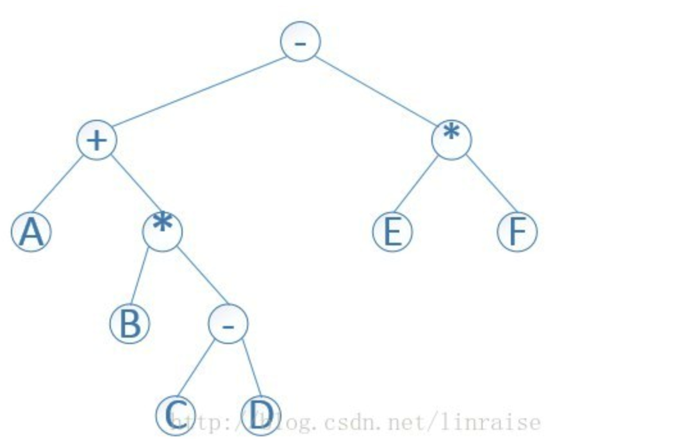

作者：黄兢成

链接：https://www.zhihu.com/question/41103160/answer/452481026

来源：知乎

著作权归作者所有。商业转载请联系作者获得授权，非商业转载请注明出处。

[Wikipedia](https://link.zhihu.com/?target=https%3A//en.wikipedia.org/wiki/Reverse_Polish_notation) 已经说得很清楚了，我只是复述一下。

逆波兰表达式，英文为 Reverse Polish notation，跟波兰表达式（Polish notation）相对应。之所以叫波兰表达式和逆波兰表达式，是为了纪念波兰的数理科学家 Jan Łukasiewicz。其在著作中提到：

> 我在1924年突然有了一个无需括号的表达方法，我在文章第一次使用了这种表示法。

- 平时我们习惯将表达式写成 (1 + 2) * (3 + 4)，加减乘除等运算符写在中间，因此称呼为中缀表达式。
- 而波兰表达式的写法为 (* (+ 1 2) (+ 3 4))，将运算符写在前面，因而也称为前缀表达式。
- 逆波兰表达式的写法为 ((1 2 +) (3 4 +) *)，将运算符写在后面，因而也称为后缀表达式。

波兰表达式和逆波兰表达式有个好处，就算将圆括号去掉也没有歧义。上述的波兰表达式去掉圆括号，变为 `* + 1 2 + 3 4`。逆波兰表达式去掉圆括号，变成 `1 2 + 3 4 + *` 也是无歧义并可以计算的。事实上我们通常说的波兰表达式和逆波兰表达式就是去掉圆括号的。而中缀表达式，假如去掉圆括号，将 (1 + 2) * (3 + 4) 写成 1 + 2 * 3 + 4，就改变原来意思了。

现实中，波兰表达式和逆波兰表达式，具体用于什么地方呢？

波兰表达式（前缀表达式），实际是抽象语法树的表示方式，比如中缀 (1 + 2) * (3 + 4) 编译时转成的抽象语法树为

```text
     *
  /    \
 +      + 
/ \    / \
1  2  3   4 
```

这个操作符就是根节点，操作数为左右子节点。我们将这棵树用符号表达出来，可以写成 (* (+ 1 2) (+ 3 4))。这实际就是 Lisp 的 S-表达式。S-表达式可看成将整棵抽象语法树都写出来，每层节点都加上圆括号。

至于逆波兰表示式，可用栈进行计算，天生适合于基于栈的语言。遇到数字就将数字压栈，遇到操作符，就将栈顶的两个元素取出计算，将计算结果再压入栈。比较典型的基于栈的语言为 Forth 和 PostScript。

延伸扩展一下。

我最近看了这篇文章，[提高 lua 处理向量运算性能的一点尝试](https://link.zhihu.com/?target=https%3A//blog.codingnow.com/2018/01/lua_linalg.html)，原文为了减少 lua 和 C 通信的交互成本，设计了一些向量运算的指令。将 mat1、mat2 压栈，写成

```text
command ( mat1, mat2, "*~")
```

来替代中缀写法

```text
~ (mat1 * mat2)
```

`command ( mat1, mat2, "*~")` 实际就是逆波兰表达式 `mat1 mat2 * ~`。

再之后读了这个文章 [编程珠玑番外篇-P PostScript 语言里的珠玑](https://link.zhihu.com/?target=https%3A//blog.youxu.info/2014/06/10/postscript/)。

顺手查查知乎，看到了这个问题。有些答案甚至写了逆波兰表达式的计算过程，只是并不能很好回答这些东西有什么用。于是再查查 Wikipedia，写下这个回答。


计算式

```
A+B(C-D)-E * F
```




## 前缀缀表达式

A * B - C D * E F

## 后缀表达式

A B C D - * + E F * -